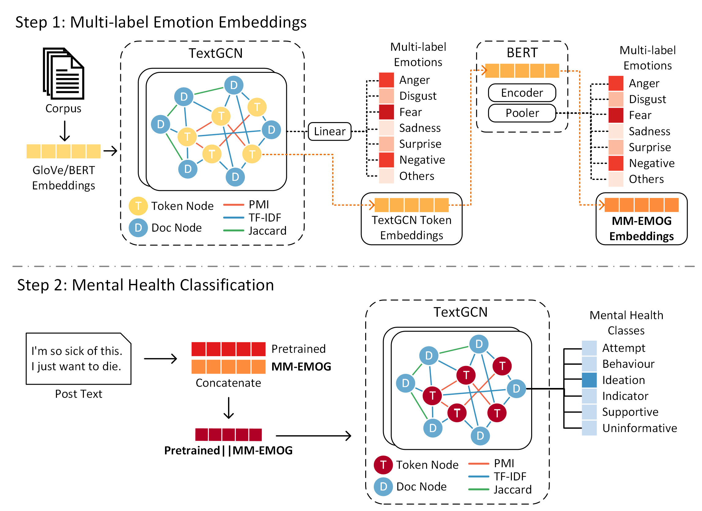
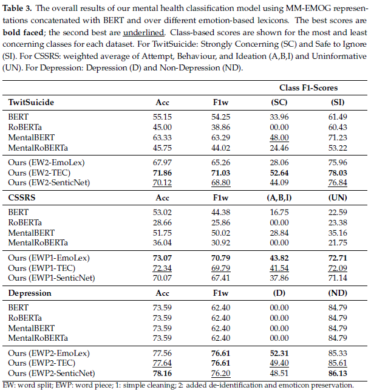

# MM-EMOG: Multi-Label Emotion Graph Representation for Mental Health Classification on Social Media

**Rina Carines Cabral, Soyeon Caren Han, Josiah Poon, Goran Nenadic**

Accepted at Robotics (AI in Robotics) 2024: https://doi.org/10.3390/robotics13030053

<p align="center">
		     
</p>

## Resources
### Datasets
- **TwitSuicide** ([paper](https://arxiv.org/abs/2206.08673); available upon request) - Twitter-based dataset following the data collection and annotation methods of O'Dea et al. ([paper](https://doi.org/10.1016/j.invent.2015.03.005))
- **CSSRS** ([paper](https://doi.org/10.1145/3308558.3313698); [download](https://github.com/AmanuelF/Suicide-Risk-Assessment-using-Reddit)) - Reddit-based dataset collected from different mental health subreddits. We use the provided post-level annotations with six classes.
- **Depression** ([download](https://github.com/swcwang/depression-detection)) - Twitter-based dataset used as the basis for the practice dataset for CLPsych 2021 ([paper](https://doi.org/10.18653/v1/2021.clpsych-1.7)).

### Emotion Lexicons
Please download into the __LEXICONS_ folder.
- **EmoLex** ([paper](https://doi.org/10.1111/j.1467-8640.2012.00460.x); [download](https://saifmohammad.com/WebPages/NRC-Emotion-Lexicon.htm))
- **TEC** ([paper](https://doi.org/10.1111/coin.12024); [download](https://saifmohammad.com/WebPages/lexicons.html))
- **SenticNet** ([paper](https://aclanthology.org/2022.lrec-1.408); [download](https://sentic.net/downloads/))

### Pre-trained Word Vectors
We use GloVe ([paper](https://doi.org/10.3115/v1/D14-1162)) and BERT ([paper](https://doi.org/10.18653/v1/N19-1423)) embeddings for our study, depending on the tokenisation method used. The BERT embeddings are handled in code through the HuggingFace library. However, the GloVe embeddings must be downloaded from [here](https://nlp.stanford.edu/projects/glove/). For this study, we use the Twitter 27B 100d vectors. Place in the __resources_ folder.

## MM-EMOG Training

We incorporate complex emotions into contextual embeddings through a multi-label emotion classification task using TextGCN ([paper](https://doi.org/10.1609/aaai.v33i01.33017370)) and BERT. First, we create document-level, multi-label emotion classes using emotion lexicons through the union of all emotions detected from each document. We use these as the targets for learning MM-EMOG representations. In the first phase of the MM-EMOG learning, we use a two-layer TextGCN followed by a linear layer for the multi-label emotion classification task and extract the hidden representations of the token nodes. These hidden representations are then used as initial weights of BERT for the same task. After BERT training, the learned word embeddings are extracted as the MM-EMOG representations.

The code for MM-EMOG training may be found on the _"MM_EMOG_Embeddings.ipynb"_ file. Data, preprocessing, tokenisation, and model parameters may be set on the code block under the _**Setup**_ section. We investigate the effect of different tokenisation setups by evaluating wordpiece (wp) and word split (ws) tokenisation. This may be set on the `TOKEN_TYPE` variable.

```
original_train_sentences = []   #Add texts
original_train_labels = []      #Add labels
TOKEN_TYPE = "wp"               #wp: WordPiece; ws: WordSplit
```

## Mental Health Classification

We evaluate our MM-EMOG embeddings through mental health classification tasks. Similar to the MM-EMOG training, we leverage a two-layer TextGCN architecture that learns the mental health risk class for each evaluated dataset.

This code may be found on the _"MentalHealthClassification_TextGCN.ipynb"_ file. As with the previous section, the data, preprocessing, tokenisation, and model parameters may be set on the code block under the _**Setup**_ section. To use the newly learned MM-EMOG embeddings, set the `mmemogFile` variable to the file path of the MM-EMOG .pkl file.

## Evaluation

<p align="center">
		     
</p>

## Citation
```
@Article{cabral2024mm-emog,
AUTHOR = {Cabral, Rina Carines and Han, Soyeon Caren and Poon, Josiah and Nenadic, Goran},
TITLE = {MM-EMOG: Multi-Label Emotion Graph Representation for Mental Health Classification on Social Media},
JOURNAL = {Robotics},
VOLUME = {13},
YEAR = {2024},
NUMBER = {3},
ARTICLE-NUMBER = {53},
URL = {https://www.mdpi.com/2218-6581/13/3/53},
ISSN = {2218-6581},
ABSTRACT = {More than 80% of people who commit suicide disclose their intention to do so on social media. The main information we can use in social media is user-generated posts, since personal information is not always available. Identifying all possible emotions in a single textual post is crucial to detecting the user’s mental state; however, human emotions are very complex, and a single text instance likely expresses multiple emotions. This paper proposes a new multi-label emotion graph representation for social media post-based mental health classification. We first construct a word–document graph tensor to describe emotion-based contextual representation using emotion lexicons. Then, it is trained by multi-label emotions and conducts a graph propagation for harmonising heterogeneous emotional information, and is applied to a textual graph mental health classification. We perform extensive experiments on three publicly available social media mental health classification datasets, and the results show clear improvements.},
DOI = {10.3390/robotics13030053}
}
```
